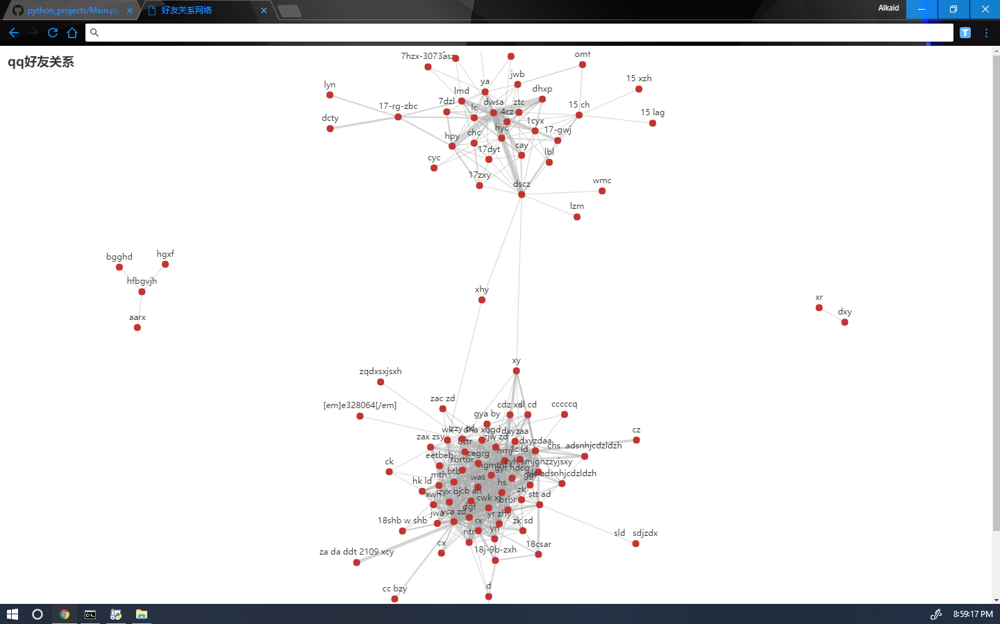
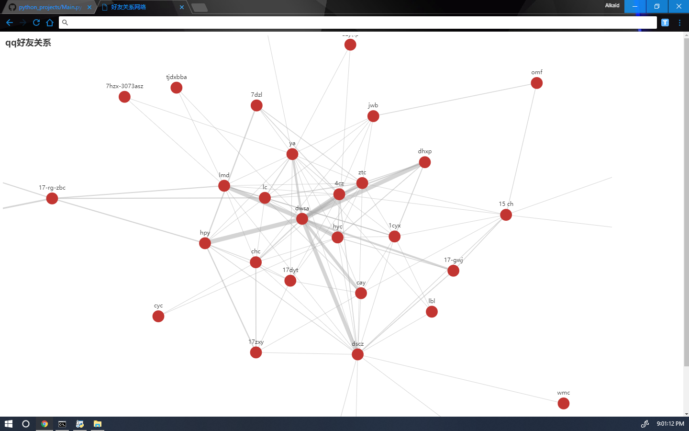

# qzone spider to find friends 
## qq空间爬虫生成好友关系网

**由于之前介绍的文章存在时效性, 请以这里的操作步骤为准!!**

1.修改 1_cookie.py 里的 chromrdriver 地址（设置了环境变量的可不修改）。修改账号密码后运行，在 temp 文件夹中生成 cookie_dict.txt

2.运行 2_spider.py 爬取数据, 在 temp 文件夹中生成 comment.txt (好友之间的评论关系)，like.txt (点赞记录)， denied.txt(空间屏蔽你的好友名单)

3.运行 3_analysis.py，得到 index.html, 打开 index.html

4.enjoy it

## 其他

1. 若好友空间不可进或者他屏蔽了发过的说说，会造成遗漏

2. 由于是通过互相评论和点赞的记录来计算关系，因此部分存在感弱的人会被遗漏

3. 爬虫太慢了

4. 2020-02-14 最后一次 push. 删掉了 php, 简化了过程. **此项目之后不再维护!!!!!!!**

## 最终效果

